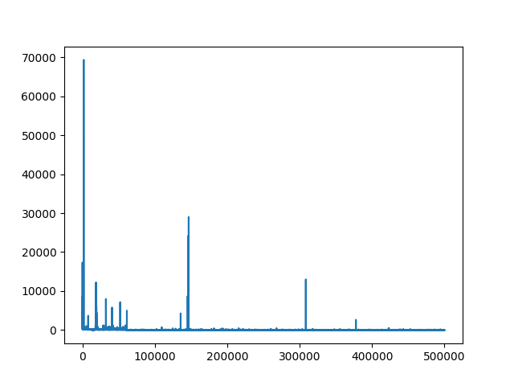

# jvm-tiered-compilation-test

JVM의 Tiered Compilation 관찰해보기

## 과정

1. 예제 자바 프로그램 작성하기
2. 현재 시스템의 C1, C2 컴파일러 Threshold 값 확인하기
3. 적절한 JVM 옵션과 함께 예제 프로그램 실행하면서 관찰하기
   - 메서드 호출, 반복문 실행 횟수 등을 조절
   - C1, C2 컴파일 로그 메시지 확인
   - 코드 캐시의 모니터링이 가능하다면 코드 캐시가 늘어나는 것도 확인해보기

## 1. 예제 자바 프로그램 작성하기

[Application.java](./Application.java)

```java
public class Application {
    public static void main(String[] args) {
        int iterCount = Integer.parseInt(args[0]);
        int[] numbers = { 1, 2, 3, 4, 5, 6, 7, 8, 9, 10 };

        for (int i = 0; i < iterCount; ++i) {
            findMax(numbers);
        }
    }

    public static int findMax(int[] arr) {
        int max = 0;
        for (int n : arr) {
            max = n > max ? n : max;
        }

        return max;
    }
}
```

프로그램의 첫 번째 파라미터로 받은 `iterCount`만큼 `findMax` 메서드를 반복 실행.

## 2. 현재 시스템의 C1, C2 컴파일러 Threshold 값 확인하기

JVM 실행 시 `XX:+PrintFlagsFinal` 옵션을 통해 기본 값을 확인할 수 있다.

```bash
java -XX:+PrintFlagsFinal -version | grep Threshold | grep Tier
```

```
openjdk version "17.0.5" 2022-10-18 LTS
OpenJDK Runtime Environment Zulu17.38+21-CA (build 17.0.5+8-LTS)
OpenJDK 64-Bit Server VM Zulu17.38+21-CA (build 17.0.5+8-LTS, mixed mode, sharing)
    uintx IncreaseFirstTierCompileThresholdAt      = 50                                        {product} {default}
     intx Tier2BackEdgeThreshold                   = 0                                         {product} {default}
     intx Tier2CompileThreshold                    = 0                                         {product} {default}
     intx Tier3BackEdgeThreshold                   = 60000                                     {product} {default}
     intx Tier3CompileThreshold                    = 2000                                      {product} {default}
     intx Tier3InvocationThreshold                 = 200                                       {product} {default}
     intx Tier3MinInvocationThreshold              = 100                                       {product} {default}
     intx Tier4BackEdgeThreshold                   = 40000                                     {product} {default}
     intx Tier4CompileThreshold                    = 15000                                     {product} {default}
     intx Tier4InvocationThreshold                 = 5000                                      {product} {default}
     intx Tier4MinInvocationThreshold              = 600                                       {product} {default}
```

주목할 것은 아래 6가지의 값.

- `Tier3InvocationThreshold` : 200
- `Tier3BackEdgeThreshold` : 60000
- `Tier3CompileThreshold` : 2000
- `Tier4InvocationThreshold` : 5000
- `Tier4BackEdgeThreshold` : 40000
- `Tier4CompileThreshold` : 15000

> - Tier3, Tier4는 각각 C1 컴파일러에 의한 레벨 3 최적화와 C2 컴파일러에 의한 레벨 4 최적화를 의미
> - InvocationThreshold란 메서드의 호출 횟수에 대한 임계치를 의미
> - BackEdgeThreshold란 메서드 내 반복 횟수에 대한 임계치를 의미
> - CompileThreshold란 Invocation과 BackEdge 횟수 합에 대한 임계치를 의미

## 3. 적절한 JVM 옵션과 함께 예제 프로그램 실행하면서 관찰하기

```bash
# 컴파일
javac Application.java

# 실행
java -XX:+UnlockDiagnosticVMOptions -XX:+LogCompilation Application <iterCount>
```

> -XX:+LogCompilation
>
> Enables logging of compilation activity to a file named hotspot.log in the current working directory. You can specify a different log file path and name using the -XX:LogFile option.
>
> By default, this option is disabled and compilation activity is not logged. The -XX:+LogCompilation option has to be used together with the -XX:+UnlockDiagnosticVMOptions option that unlocks diagnostic JVM options.
>
> You can enable verbose diagnostic output with a message printed to the console every time a method is compiled by using the -XX:+PrintCompilation option.
>
> -XX:+UnlockDiagnosticVMOptions
>
> Unlocks the options intended for diagnosing the JVM. By default, this option is disabled and diagnostic options are not available.
>
> https://docs.oracle.com/javase/8/docs/technotes/tools/unix/java.html

### Test 1. iterCount = 10

[iterCount_10.log](./iterCount_10.log)

- `findMax`가 컴파일되지 않았음
- 아래 네 개의 메서드들이 레벨 3 컴파일된 것을 확인
  - `java.lang.String hashCode ()I`
  - `java.lang.Object &lt;init&gt; ()V`
  - `java.lang.String coder ()B`
  - `java.lang.String length ()I`

### Test 2. iterCount = 200

[iterCount_200.log](./iterCount_200.log)

- `findMax`가 컴파일되지 않았음
- `Tier3InvocationThreshold` 값이 200인데, 왜 컴파일되지 않았을까?

### Test 3. iterCount = 205

1. [iterCount_205_1.log](./iterCount_205_1.log)

`findMax`가 task_queued 되었지만 컴파일되진 못했음

2. [iterCount_205_2.log](./iterCount_205_2.log)

`findMax`가 레벨 3 컴파일되었음

iterCount를 204로 1000번, 205로 똑같이 1000번 실행해봤을 때 `findMax`가 컴파일 큐에 들어가거나 컴파일까지 완료된 횟수는 204일때 0번, 205일때 998회 정도.
확실하진 않으나 iterCount=200일때 컴파일이 안된 것도 단순히 타이밍 문제가 아니었나 싶다.

(궁금해서 해봤을 뿐이지, Threshold 값 튜닝을 하거나 웜업 카운트를 조정한다면 그냥 여유 있게 설정하는게 나을 것 같다.)

### Test 4. iterCount = 5000 ~ 500000

iterCount를 5,000에서 500,000까지 실행해봤을 때의 현상 또는 의문들.

#### 1. ([iterCount_5000.log](./iterCount_5000.log)) `findMax` 메서드가 한 번 호출될 때 반복문은 10회 실행되는데(길이 10짜리 배열을 넘겼으니), Backedge count가 10을 훨씬 넘어선다. Backedge count는 메서드 단 한 번 호출 내에서의 반복 횟수를 세는 줄 알았는데, 그게 아닌가?

#### 2. ([iterCount_5000.log](./iterCount_5000.log)) Invocation count가 1,961인데 레벨 4 컴파일 작업이 큐에 추가되었다. `Tier4InvocationThreshold` 값이 5,000이라는 것을 생각하면 조금 의아하다.

=> Tiered compilation의 기준이 그리 단순한 것 같진 않고, Threshold 값에 대해 C1, C2 컴파일의 정확한 기준(OpenJDK에서)은 [advancedThresholdPolicy.hpp](https://hg.openjdk.org/jdk8u/jdk8u/hotspot/file/2b2511bd3cc8/src/share/vm/runtime/advancedThresholdPolicy.hpp#l34)

#### 3. ([iterCount_50000.log](./iterCount_50000.log)) `findMax` 메서드에 대한 레벨 4 컴파일 작업을 마친 쓰레드(컴파일러 쓰레드로 추정)가 `nmethod` 로그 직후에 `make_not_entrant` 로그를 남겼다.

=> [여기](https://stackoverflow.com/questions/2930838/java-printcompilation-output-whats-the-meaning-of-made-not-entrant-and-made)에 따르면, 하단 OpenJDK 코드와 관련 있는 듯 하다.

```cpp
// https://hg.openjdk.org/jdk7/jdk7/hotspot/file/9f5b60a14736/src/share/vm/code/nmethod.hpp

// Make the nmethod non entrant. The nmethod will continue to be
// alive.  It is used when an uncommon trap happens.  Returns true
// if this thread changed the state of the nmethod or false if
// another thread performed the transition.
bool  make_not_entrant()                        { return make_not_entrant_or_zombie(not_entrant); }
```

=> [여기](https://stackoverflow.com/questions/61890873/why-does-java-just-in-time-compiler-continue-to-recompile-same-methods-and-make)에서 좀 더 부연 설명이 되는 듯.

레벨 3로 컴파일 되어 있던 코드는 `in_use` 상태를 유지하다가, 레벨 4 컴파일 이후 `make_not_entrant()`에 의해 `not_entrant` 상태로 전이된다. 이후 더 이상 호출되지 않는 경우 `zombie` 상태가 되었다가 제거될 것.

#### 4. ([iterCount_70000.log](./iterCount_70000.log)) `main` 메서드에서 for 루프가 너무 오래 실행되니(Backedge count가 60,416 정도), `main` 메서드에 대한 레벨 3 OSR(Open Stack Replacement)이 발생하였다.

#### 5. ([iterCount_90000.log](./iterCount_90000.log)) `main` 메서드의 Backedge count가 72,490일때 OSR이 아닌 다른 레벨 3 컴파일 작업이 큐에 추가되었다. 이미 위에서 OSR을 통해 레벨 3로 컴파일된 머신 코드가 실행되고 있을 것 같은데, 왜 다시 컴파일 요청을 하는지 모르겠다.

#### 6. ([iterCount_500000.log](./iterCount_500000.log)) `main` 메서드의 Backedge count가 101,899일때 레벨 4 OSR 컴파일 작업이 큐에 추가되었다. 그리고는 컴파일이 완료되어 `nmethod` 로그가 나타난 직후에 `make_not_entrant` 로그가 나타났다.

#### 7. ([iterCount_500000.log](./iterCount_500000.log)) 처음으로 `deoptimized` 로그가 발생했고, 대상은 `main`으로 보인다. 또한 `uncommon_trap` 로그가 발생하였다.

### Test 5. iterCount = 500000 + 시간 측정

```java
public class Application {
    public static void main(String[] args) {
        int iterCount = Integer.parseInt(args[0]);
        int[] numbers = { 1, 2, 3, 4, 5, 6, 7, 8, 9, 10 };

        for (int i = 0; i < iterCount; ++i) {
            long before = System.nanoTime();
            findMax(numbers);
            long after = System.nanoTime();
            System.out.println(i + " " + (after - before));
        }
    }

    public static int findMax(int[] arr) {
        int max = 0;
        for (int n : arr) {
            max = n > max ? n : max;
        }

        return max;
    }
}
```

```python
python3 graph_iteration_x_time.py
```



[iterCount_500000_with_timer.log](./iterCount_500000_with_timer.log)

컴파일 전후로 실행이 빨라지긴 하는데, `findMax`보단 더 오래 걸릴만한 코드로 테스트할 필요가 있다.
피크 뜨는 부분들은 `task_queued` 부분이 많은 듯.
